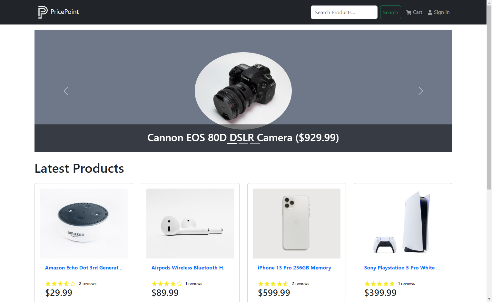

# PricePoint

Welcome to PricePoint, a comprehensive eCommerce platform I built using the MERN stack (MongoDB, Express, React, Node.js) along with Redux Toolkit

Enjoy the website and feel free to create a user account or use any of the sample users listed below.

Website: https://pricepoint-r50d.onrender.com

## Screenshot 



## Features

- **Full-Featured Shopping Cart**: Complete shopping cart functionality, including the ability to adjust quantities of selected items.
- **Product Reviews and Ratings**: Share and view product reviews and ratings submitted by other users.
- **Top Products Carousel**: Discover popular products through a carousel display on the homepage.
- **Product Pagination**: Easily navigate through product listings with pagination functionality.
- **Product Search**: Find specific products quickly and efficiently using the search feature.
- **User Profile with Orders**: Access and manage user profiles, including viewing order history.
- **Admin Product Management**: Admin-exclusive functionality for managing products.
- **Admin User Management**: Admin privileges to manage user accounts and permissions.
- **Admin Order Details Page**: Gain detailed information about each order from the admin dashboard.
- **Mark Orders as Delivered**: Admins can mark orders as delivered to update order status.
- **Checkout Process**: Seamless checkout process with options for shipping, payment method, and more.
- **PayPal / Credit Card Integration**: Securely process payments using PayPal or credit card integration.
- **Custom Database Seeder Script**: Automate the process of seeding the database with sample data.

## Key Takeaways

- **React**: Building user interfaces using functional components and hooks.
- **React Router**: Implementing client-side routing for seamless navigation.
- **React-Bootstrap**: Utilizing the React-Bootstrap UI library to create a visually appealing interface.
- **Component Structure**: Understanding how to organize and structure components effectively.
- **Component State and Props**: Managing component-level state and passing props between components.
- **Global State Management with Redux**: Utilizing Redux actions and reducers to manage global application state.
- **Redux State in Components**: Accessing and using Redux state within components using useDispatch and useSelector.
- **Express**: Creating a robust back end using the Express framework.
- **Postman**: Utilizing Postman to extensively test the CRUD API endpoints, ensuring proper functionality, data validation, and error handling, resulting in a reliable and well-tested backend system.
- **MongoDB and Mongoose**: Working with a MongoDB database and utilizing the Mongoose ODM (Object Data Modeling).
- **JWT Authentication**: Implementing JSON web token (JWT) authentication with HTTP-Only cookies.
- **Custom Authentication Middleware**: Creating custom middleware for authentication purposes.
- **Custom Error Handling**: Implementing a custom error handler for better error management.
- **PayPal API Integration**: Integrating the PayPal API for secure payment processing.
- **Environment Variables**: Understanding the use of environment variables for configuration and security.

## Sample User Logins
```
admin@email.com (Admin)
123456

john@email.com (Customer)
123456

jane@email.com (Customer)
123456
```
I hope you enjoy! 😃


